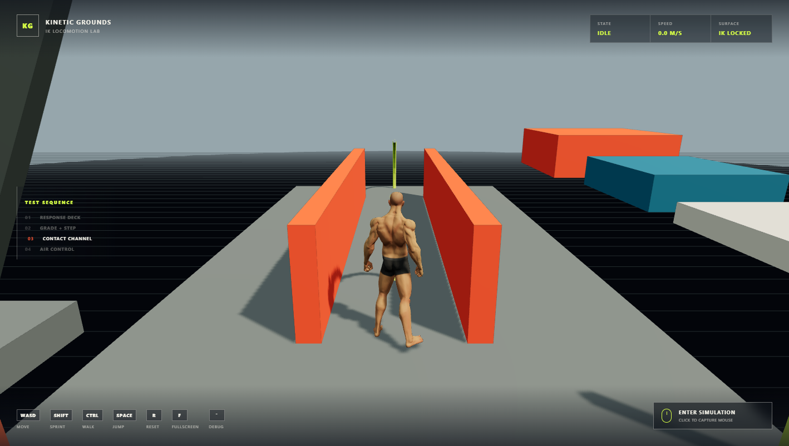

# Kinetic Grounds

Kinetic Grounds is a browser-based third-person locomotion and inverse-kinematics showcase built with Three.js, TypeScript, and Rapier. It uses an authored, skinned humanoid model and motion library inside a compact abstract course designed to exercise acceleration, slopes, stairs, uneven footing, jumping, landing, camera collision, and contextual hand contacts.



## Current feature set

- Camera-relative walking, jogging, sprinting, turning, jumping, falling, and landing.
- Fixed-step kinematic capsule controller with acceleration, braking, gravity, slope limits, autostep, ground snapping, coyote time, and jump buffering.
- Authored Quaternius humanoid model with idle, walk, jog, sprint, jump-start, airborne, and landing animations.
- Terrain-aware foot IK with ground probes, stance locking, pelvis compensation, reach limits, and sole alignment to surface normals.
- Contextual hand IK on tagged walls and waist-height contact surfaces. The solver derives each arm's outward direction from the animated shoulder, so it does not assume a particular rig handedness.
- Damped third-person camera with mouse orbit, zoom, velocity-aware targeting, pitch limits, and sphere-cast obstruction avoidance.
- Deterministic low-poly test course covering shallow and rejected slopes, varied stairs, uneven tiles, landings, a contact corridor, jump gaps, and fall recovery.
- Loading screen, compact telemetry HUD, route indicator, pointer-lock prompt, fullscreen toggle, and optional physics/IK diagnostics.
- Offline runtime assets: the application does not fetch models, animation clips, textures, or scripts from third-party services after installation.

## Technology

| Layer | Implementation |
| --- | --- |
| Rendering | Three.js `WebGLRenderer`, authored GLB assets, directional shadows, fog, ACES tone mapping |
| Physics | `@dimforge/rapier3d-compat` with a position-based kinematic capsule |
| Animation | Three.js `AnimationMixer` and semantic clip state machine |
| IK | Custom analytic two-bone limb solver applied after animation sampling |
| Application | Vanilla TypeScript, HTML, and CSS |
| Tooling | Vite, TypeScript project references, Vitest |

## Requirements and setup

- Node.js 22.12+ or 20.19+
- A current desktop browser with WebGL2 and Pointer Lock support
- Keyboard and mouse

Install and start the development server:

```powershell
npm.cmd install
npm.cmd run dev
```

Open the URL printed by Vite, then click **Enter Simulation** to capture the mouse.

For a production build:

```powershell
npm.cmd run build
npm.cmd run preview
```

The production output is written to `dist/` and can be hosted as a static site.

## Controls

| Input | Action |
| --- | --- |
| `W`, `A`, `S`, `D` | Move relative to the camera |
| `Ctrl` | Walk while held |
| `Shift` | Sprint while held |
| `Space` | Jump |
| Mouse | Orbit camera while pointer is captured |
| Mouse wheel | Change follow distance |
| `R` | Reset to the response deck |
| `F` | Toggle browser fullscreen on or off |
| Backquote | Toggle collider, IK target, state, and render diagnostics |
| `Esc` | Release pointer lock; the browser also uses it to leave fullscreen |

## Runtime architecture

The application is assembled in `src/main.ts`. Startup initializes Rapier, the renderer, lighting, course colliders, motor, camera, input, authored character, animation clips, HUD, and debug visualization. Asset failures are reported in the interface instead of substituting a procedural player.

The live frame flow is:

```text
Keyboard + mouse
      |
      v
InputController --> CharacterMotor --> Rapier collision correction
                           |                     |
                           v                     v
                    MotorSnapshot ------> ThirdPersonCamera
                           |
                           v
                AnimationMixer base pose
                           |
                           v
                 Foot IK + hand IK
                           |
                           v
                     Three.js render
```

Physics uses a 60 Hz accumulator. Each fixed step updates the motor, asks Rapier to correct the desired capsule translation, advances the physics world, and publishes a `MotorSnapshot`. Animation, IK, camera damping, HUD updates, and rendering use the latest snapshot once per display frame.

### Character motor

`src/CharacterMotor.ts` owns the player rigid body, capsule collider, Rapier character controller, and locomotion state. Movement input is converted from camera space to world space, including the camera's screen-right convention for `A` and `D`. Horizontal velocity approaches gait-specific targets with separate acceleration, braking, and air-control rates.

The motor currently provides:

- 2.0 m/s walk, 4.5 m/s jog, and 7.5 m/s sprint targets.
- 6.25 m/s jump impulse and 18 m/s² gameplay gravity.
- 120 ms coyote time and 140 ms jump buffering.
- 0.35 m autostep, 0.30 m ground snap, 48° maximum climb slope, and automatic sliding above 52°.
- Soft and hard landing states selected from downward impact speed.
- Automatic reset when the player falls below the course or leaves its safety bounds.

### Animation system

`src/AnimatedCharacter.ts` loads the authored player from `night-striker.glb` and the no-root-motion library from `universal-animation-library.glb`. Both assets share the same named humanoid hierarchy, so clips bind directly to the visible rig.

The semantic states are `idle`, `walk`, `jog`, `sprint`, `jumpStart`, `airborne`, `land`, and `hardLand`. Crossfades smooth state changes, while locomotion clip playback rates are bounded around the current physics speed. Physics always owns translation; animation never moves the collision capsule through root motion.

### Foot IK

Foot IK runs after every `AnimationMixer` update:

1. Each animated ankle casts downward into the Rapier world while excluding the player capsule.
2. The hit point and normal produce a terrain-aware ankle target.
3. Low vertical foot motion identifies a stance phase and locks the planted target in world space.
4. The pelvis is raised or lowered within configured reach limits.
5. An analytic hip-knee-ankle solve places the leg using a forward knee pole.
6. The ankle's calibrated local up axis blends toward the ground normal.
7. Locks and solver weights fade out during swing, loss of ground, or airborne states.

### Hand IK

Course colliders opt into hand contact through surface metadata. While grounded and moving, each shoulder probes outward toward eligible colliders. A valid contact produces a smoothed palm target, elbow pole, and surface-normal orientation. IK blends down at sprint speed and releases cleanly when the wall leaves reach.

Hand contacts are an animation enhancement only. The current implementation does not include grabbing, climbing, mantling, or vaulting.

### Camera

`src/ThirdPersonCamera.ts` maintains yaw, pitch, and follow distance independently from the character heading. It damps both the target and camera position, offsets framing slightly with velocity, and sphere-casts from the target toward the desired camera position. A hit shortens the spring arm before rendering, preventing most wall and terrain clipping.

### Course and presentation

`src/Course.ts` creates visual meshes and matching Rapier colliders from the same deterministic descriptors. The zones are:

1. **Response deck** - spawn, acceleration, braking, and turning.
2. **Grade and step calibration** - shallow ramp, varied risers, stairs, summit, descent, and uneven tiles.
3. **Contact channel** - tagged orange walls for contextual hand IK.
4. **Air control** - runway, separated landing pads, drops, and recovery.
5. **Slope rejection** - a 58° ramp that exceeds the controller's climb limit.

The renderer uses a capped device pixel ratio, directional shadows, hemisphere lighting, fog, flat-shaded course materials, and an abstract high-contrast palette. The current captured scene renders roughly 31,000 triangles and 130 draw calls, depending on camera visibility.

## Configuration

All primary tuning values live in `src/config.ts`:

| Group | Examples |
| --- | --- |
| Simulation | Fixed update frequency and spawn position |
| Motor | Capsule size, gait speeds, acceleration, gravity, jump timing, slopes, autostep |
| Camera | FOV, pitch, distance, sensitivity, damping, collision radius |
| IK | Probe range, ankle height, pelvis limits, lock release distance, hand reach |
| Quality | Maximum pixel ratio and shadow-map resolution |

Course geometry and contact tags are authored in `src/Course.ts`. Animation-to-state mapping and required bone names are defined in `src/AnimatedCharacter.ts`.

## Project layout

```text
public/assets/quaternius/    Bundled character, animations, and CC0 license files
scripts/qa-browser.mjs      Chrome DevTools integration and screenshot harness
src/AnimatedCharacter.ts    Asset loading, animation state machine, hand and foot IK
src/CharacterMotor.ts       Rapier controller and locomotion state
src/Course.ts               Visual course and matching fixed colliders
src/InputController.ts      Keyboard, pointer lock, mouse orbit, and fullscreen input
src/ThirdPersonCamera.ts    Follow camera and obstruction avoidance
src/config.ts               Central tuning values
src/main.ts                 Bootstrap, fixed-step loop, HUD, debug and recovery
src/styles.css              Loading screen, HUD, telemetry, prompts and responsive layout
```

## Testing and validation

Run the complete static and unit validation:

```powershell
npm.cmd run check
```

The current suite contains seven tests covering:

- Angle wrapping, damping, easing, and planar velocity math.
- Ground settling, camera-forward acceleration, jumping, and correct `A`/`D` orientation.
- GLB signatures, authored mesh/skin presence, required humanoid bones, and semantic locomotion clips.

Build validation is separate:

```powershell
npm.cmd run build
```

`scripts/qa-browser.mjs` drives a real headless Chrome session through the DevTools protocol. It waits for the simulation to become grounded, verifies forward movement and jumping, teleports to the development-only contact fixture, confirms live hand IK, records render statistics and browser exceptions, and writes the gameplay screenshot used above.

When a Vite server is already running, launch the browser automatically with:

```powershell
node scripts/qa-browser.mjs http://127.0.0.1:9223 docs/kinetic-grounds-gameplay.png --launch
```

Set `CHROME_PATH` if Chrome is not installed at its standard Windows location.

## Assets and licensing

The visible player is always an authored and rigged 3D model; there is no procedural visual fallback. The bundled Universal Base Character and Universal Animation Library are CC0 assets by Quaternius. Runtime copies, upstream sources, conversion history, creator credits, and licenses are documented in [THIRD_PARTY_NOTICES.md](THIRD_PARTY_NOTICES.md) and beside the assets in `public/assets/quaternius/`.

## Current scope

This is a focused desktop locomotion vertical slice. It does not currently include touch controls, gamepad support, combat, climbing, vaulting, multiplayer, persistence, audio, or a backend. The course is deterministic, and the project targets current evergreen desktop browsers rather than legacy WebGL implementations.
